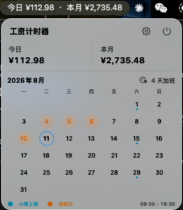

# 工资计时器

一款原生 macOS 菜单栏应用，根据工作时间实时累计今日工资与本月工资。打开菜单栏面板即可查看收入进度、标记加班日期，并按自己的作息和休息制度调整计薪规则。

  
  

## 下载与安装

[前往 GitHub Releases 下载最新版](https://github.com/hewei2723/salary/releases/latest)

1. 下载 `SalaryTimer-1.2.0.pkg`。
2. 双击安装包，将工资计时器安装到“应用程序”。
3. 安装完成后打开“工资计时器”，金额会常驻显示在菜单栏。

> 当前版本未使用 Apple Developer 签名和公证。如果 macOS 阻止打开，请先尝试打开一次，再前往“系统设置 > 隐私与安全性”点击“仍要打开”。

## 主要功能

- 在菜单栏实时显示今日工资和本月累计工资。
- 按实际日期、工作时间和午休时间计算当月收入。
- 分别设置正常时薪和加班时薪。
- 自定义上班、下班、午休与加班时间段。
- 支持双休、单休和大小周三种工作制度。
- 左键点击月历日期查看当天工资，右键快速标记或取消加班。
- 支持开机自启动。
- 界面支持简体中文、英语、日语、韩语和俄语，并自动跟随 macOS 的 App 语言。

## 1.2.0 更新

- 月历日期改为左键选中并查看当天工资。
- 右键日期通过菜单标记或取消加班，避免误操作。
- 顶部工资区域会显示所选日期；历史日期显示完整工资，今天实时累计，未来日期显示 `0.00`。
- 选中日期使用独立描边，并补充五种语言的操作提示。

## 使用方法

1. 点击菜单栏中的金额，打开工资面板。
2. 左键点击月历日期，上方会显示当天已赚工资；历史日期显示当天完整工资，未来日期显示 `0.00`。
3. 右键点击月历日期，在菜单中标记或取消当天加班。
4. 点击右上角齿轮，设置时薪、作息、休息制度和刷新频率。
5. 返回主面板后，今日与本月金额会按新规则自动更新。

## 切换语言

应用会跟随 macOS 的 App 语言。打开“系统设置 > 通用 > 语言与地区”，在“应用程序”列表中添加工资计时器，然后选择简体中文、English、日本語、한국어或 Русский。重新打开应用后即可生效。

## 默认规则

- 工作时间：`09:30 - 18:30`
- 午休时间：`12:00 - 13:00`
- 加班时间：`18:30 - 20:30`
- 休息制度：大小周
- 小周参考周六：`2026-08-15`

标记为加班的日期会在正常工资之外，按照设置的加班时间段和加班时薪累计收入。休息日被标记为加班时，只计算加班时间段。

## 数据与隐私

所有工资设置、作息规则和加班日期都保存在本机，不会上传到服务器。卸载或清理应用数据前，请自行记录需要保留的配置。

## 系统要求

- macOS 14 或更高版本
- Apple Silicon Mac
